# Wi-Fi Touch and OLED Display Demo

> "Wireless Made Easy!" - This example application acts as a TCP Server to which a TCP Client can connect and visualize QT7 Touch Xpro data. The touch data are also printed on an OLED Display.

Devices: **WFI32E01**

**Watch the video and see in action this All-in-one application running on WFI32E Curiosity board**

<a href="https://youtu.be/swsQUucujnM" target="_blank">
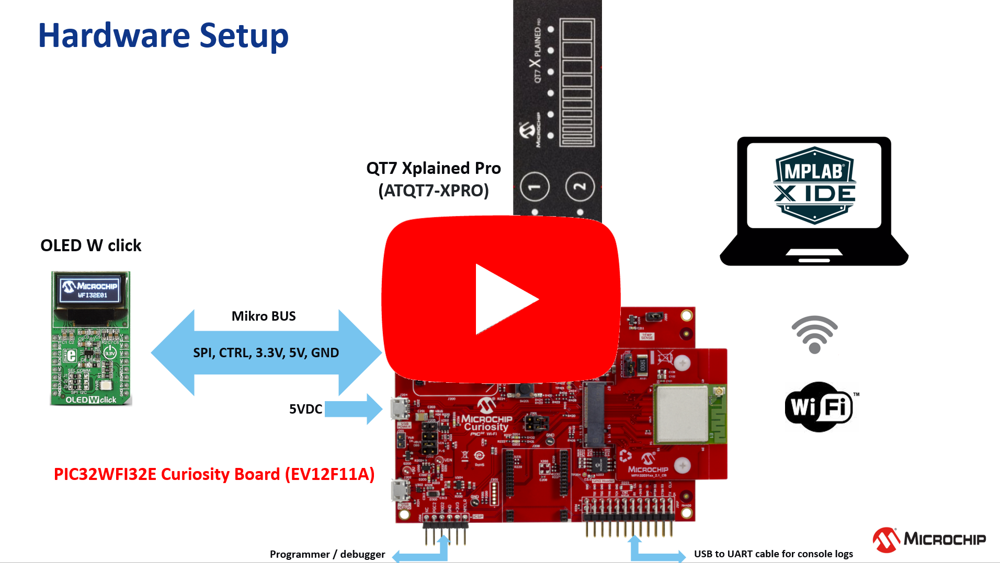</a>

## ⚠ Disclaimer

<b>
THE SOFTWARE ARE PROVIDED "AS IS" AND GIVE A PATH FOR SELF-SUPPORT AND SELF-MAINTENANCE.  
This repository contains unsupported example code intended to help accelerate client product development. It is not validated for production nor audited for security best-practices.  
Note that while this repository is unsupported, Microchip welcome community contributions, and all pull-requests will be considered for inclusion into the repository.

</b>

> Interact with peers in the community at [WiFi Forum](https://www.microchip.com/forums/f545.aspx).

## Software requirement

The sample project has been created and tested with the following Software Development Tools:
- MPLAB X IDE v6.00
- MPLAB XC32 v3.01
- MPLAB Harmony v3.6.4
   - mhc v3.8.2
   - csp v3.10.0
   - core v3.10.0
   - wireless_wifi v3.6.1
   - dev_packs v3.10.0
   - touch v3.11.0
   - wireless_system_pic32mzw1_wfi32e01 v3.6.1
   - wolfssl v4.7.0
   - net v3.7.4
   - crypto v3.7.5
   - CMSIS-FreeRTOS v10.3.1

## Hardware setup using the WFI32 Curiosity Board

- Connect [QT7 Xplained Pro](https://www.microchip.com/developmenttools/ProductDetails/atqt7-xpro) to Xpro Header of the WFI32E Curiosity board
- **J211** jumper shorted between pin 2-3 to get IRQ line
- **J209** open that disconnect on-board temperature sensor thus one of the slider Y-line is sharing the same pin

- Order the [OLED W click board](https://www.mikroe.com/oled-w-click)
- Make sure the **RST** pin of the [OLED W click](https://www.mikroe.com/oled-w-click) is not connected to the WFI32 Curiosity board (RB6 signal) but connected to a permanent 3.3V (here connected to J402 3V3_IN).\
The RB6 signal is already connected to the QT7 Xplained Pro board and used for the Capacitive Touch Driven Shield.

With this modification, the WFI32 does not control the RESET line of the OLED W click and the display is ON all the time.

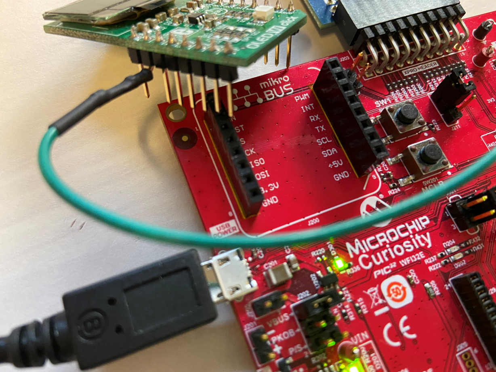
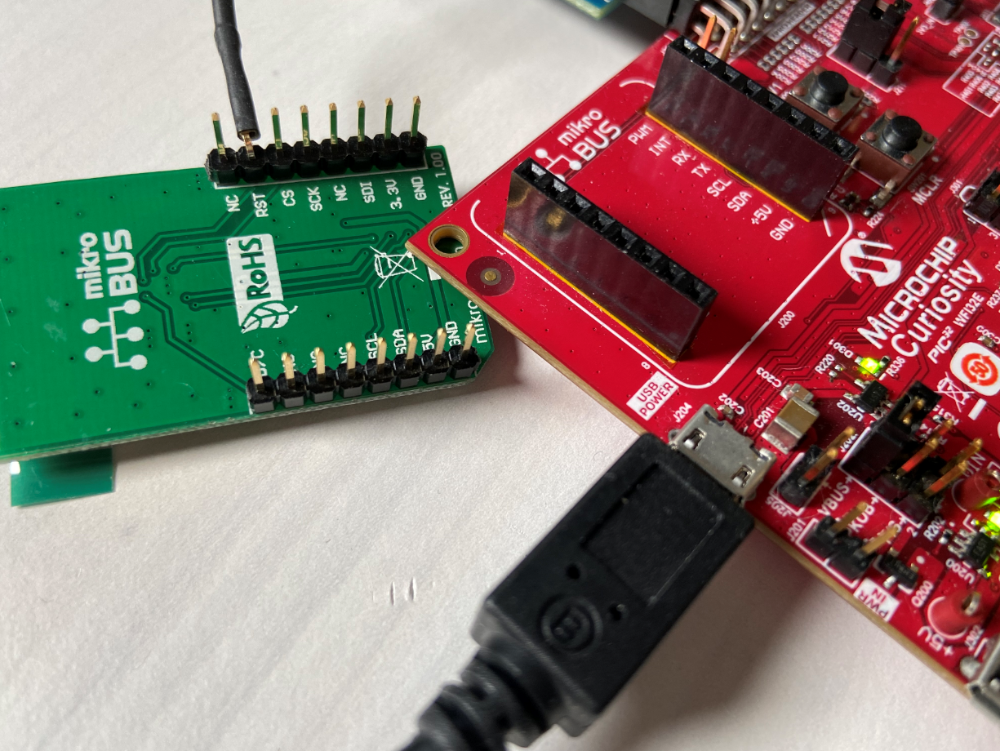

- Then attach the [OLED W click](https://www.mikroe.com/rn4871-click) to mikro BUS Header.

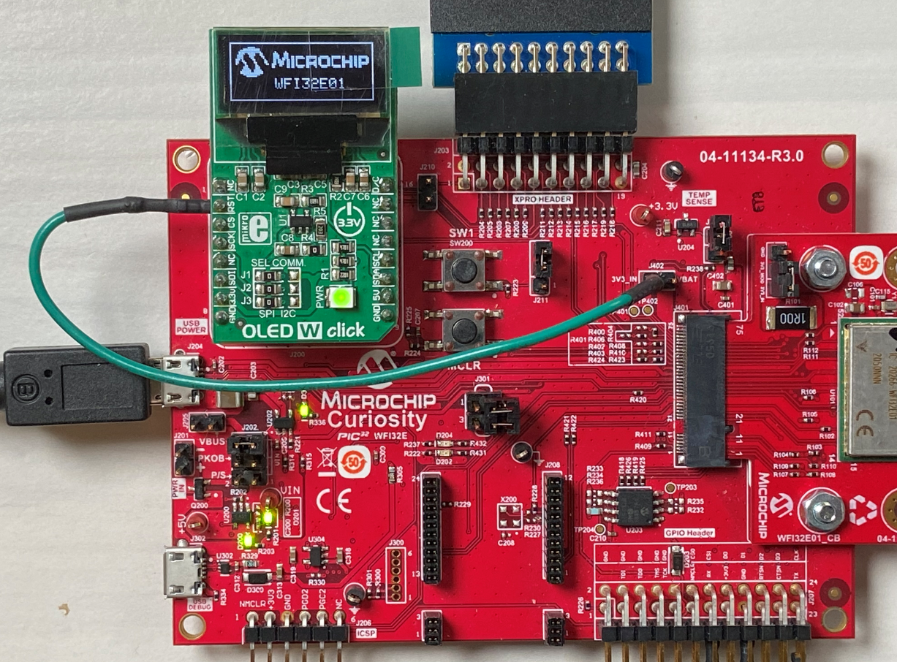
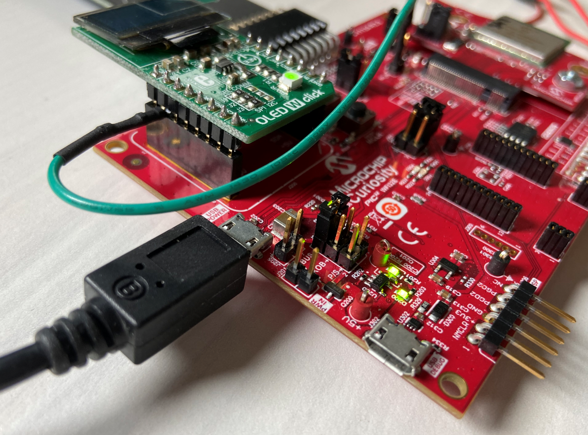

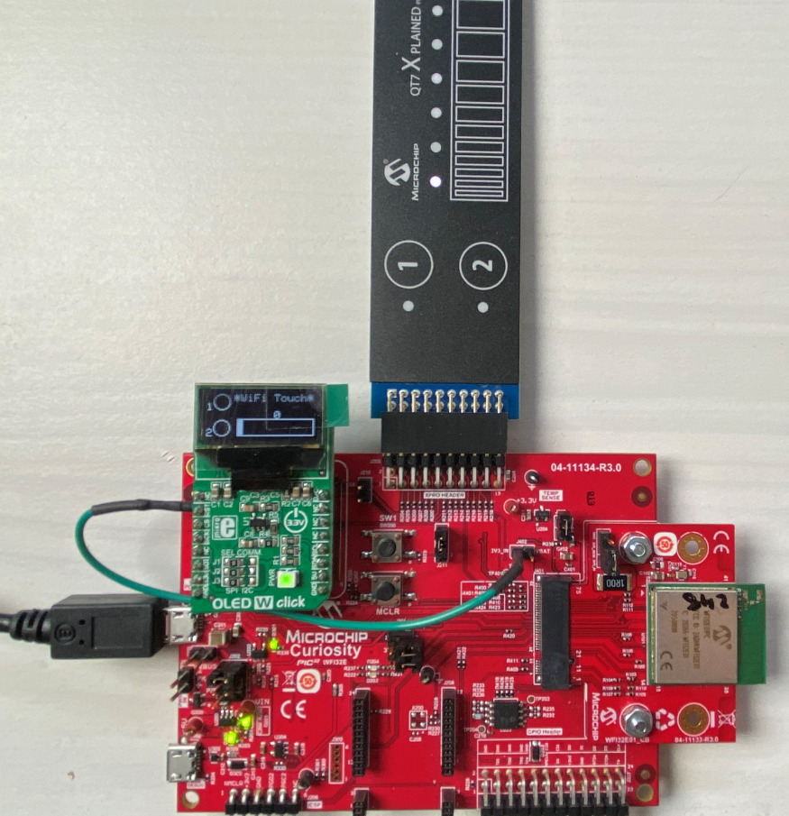

## Q7 Xpro Header

QT7 uses one slider and two touch buttons

| QT7 Xpro Header Pin | Function | Description | WFI32E01 Module Pin |
| --- | --- | --- | --- |
| 1 | ID | - | - |
| 2 | GND | - | - |
| 3 | Y-LINE-5 | Driven shield | RB6 (X1 in MHC) |
| 4 | Y-LINE-1 | Button 1 Sensor | RA14 (button 0/Y14 in MHC) |
| 5 | LED0 | LED for Slider | RB12 (LED_SLIDER_6 in MHC) |
| 6 | LED6 | LED for Button 1 | RK6 (LED_BUTTON_1 in MHC) |
| 7 | Y-LINE-2 | Slider Sensor | RB8 (slider 0/channel 4/Y8 in MHC) |
| 8 | Y-LINE-3 | Slider Sensor | RA13 (slider 0/channel 3/Y15 in MHC), shared with Temp sensor) |
| 9 | Y-LINE-4 | Slider Sensor | RA10 (slider 0/channel 2/Y17 in MHC) |
| 10 | Y-LINE-0 | Button 2 Sensor | RB2 (button 1/Y2 in MHC) |
| 11 | LED7 | LED for Button 2 | RA5 (LED_BUTTON_2) |
| 12 | LED1 | LED for Slider | RA4 (LED_SLIDER_5) |
| 13 | NC | - | - |
| 14 | NC | - | - |
| 15 | LED2 | LED for Slider | RB7 (LED_SLIDER_4) |
| 16 | LED3 | LED for Slider | RK5 (LED_SLIDER_2) |
| 17 | LED4 | LED for Slider | RK4 (LED_SLIDER_3) |
| 18 | LED5 | LED for Slider | RA11 (LED_SLIDER_1) |
| 19 | GND | - | - |
| 20 | VCC | - | - |

## OLED W click

The [OLED W click](https://www.mikroe.com/oled-w-click) carries a 96 x 39px white monochrome passive matrix OLED display. The display is bright, has a wide viewing angle and low power consumption. To drive the display, [OLED W click](https://www.mikroe.com/oled-w-click) features an [SSD1306](https://www.solomon-systech.com/en/product/display-ic/oled-driver-controller/ssd1306/) controller. Check out the [SSD1306 datasheet](https://cdn-shop.adafruit.com/datasheets/SSD1306.pdf) for more details.

In this demo, the [OLED W click](https://www.mikroe.com/oled-w-click) communicates with the WFI32 MCU through SPI lines.

## MHC Configuration

Project Graph - Root view
* Touch Library using ADCHS and TMR2 components
* Wi-Fi Service, Wi-Fi provisioning and Net services

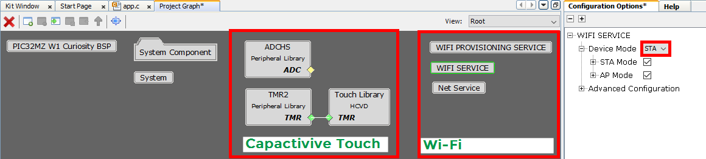

Project Graph - System component view
* SPI2 for OLED W click interface

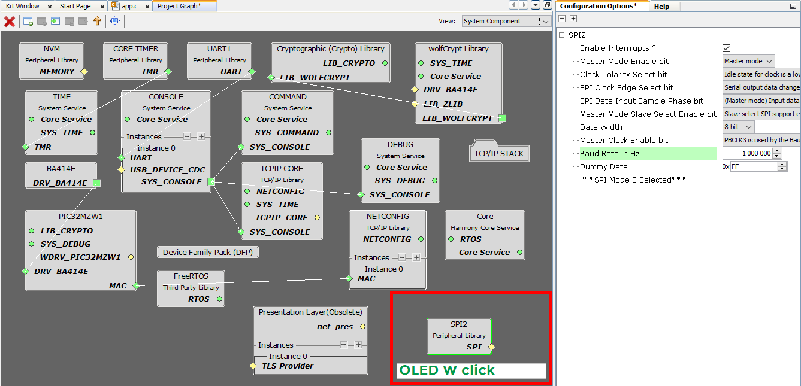

Project Graph - Net service configuration

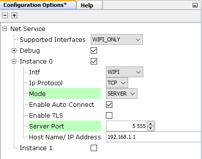

ADCHS Easy View - Enable ADC7

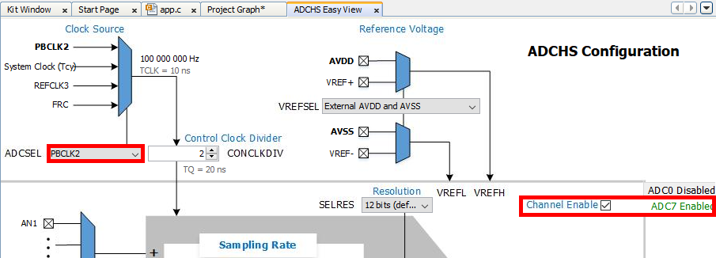

Pin Configuration

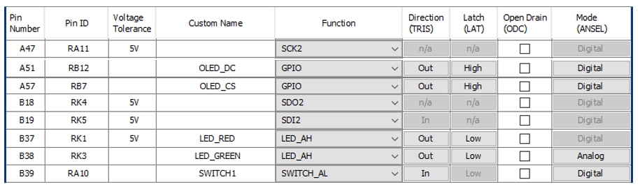

Touch Configuration

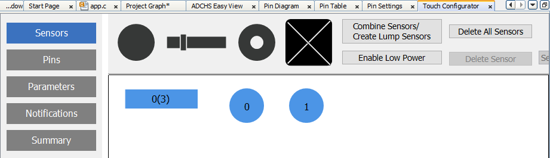
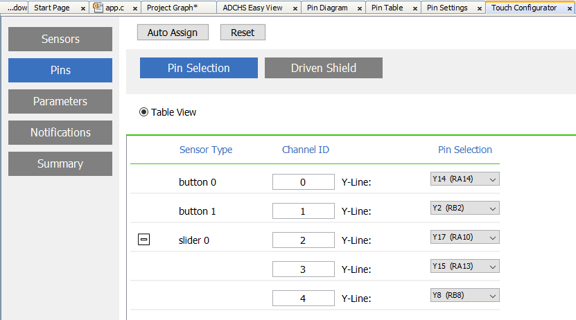
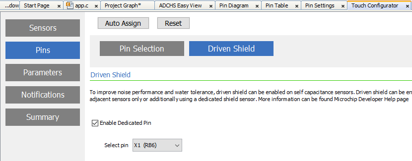
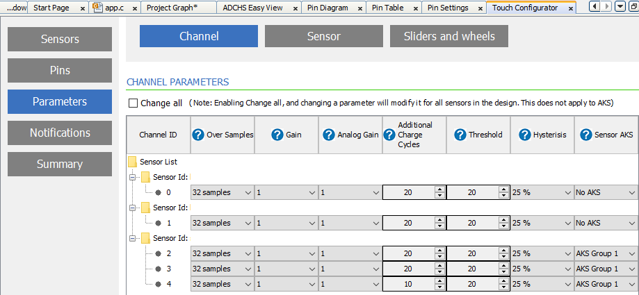

## Try it

1. Clone/download the repo
1. Open the `wifi_touch_oled` project with MPLAB X IDE
1. Build and program the code
1. Follow <a href="https://github.com/Microchip-MPLAB-Harmony/wireless_apps_pic32mzw1_wfi32e01/tree/master/apps/wifi_touch_demo" target="_blank">instructions of the Wi-Fi Touch Demo</a> to setup the interaction between the TCP Client and the TCP Server

> In this sample application, the QT7 Xplained Pro LEDs are not driven. Replacing the LEDs, the OLED Display is used to visualize the Capacitive Touch data from the buttons and the slider.

